 

<samp>
  <a href="https://ouala.me">portfolio</a>
  ·
  <a href="mailto:alioualaeddine@gmail.com">email</a>
  ·
  <a href="https://github.com/ALI-OUALA">github</a>
</samp>

---

## About

Applied mathematics student at the **National Higher School of Mathematics** in Algeria.

I build **production web products**, **AI experiments**, **automation tools**, and **design-led prototypes**.

**Currently building:** **ALvoix**, an algerian TTS/STT model (live model).

<table>
  <tr>
    <td width="50%" valign="top">
      <b>Production</b> 
      Websites, landing pages, dashboards, SaaS interfaces, MVPs, academic portfolios, and client demos.
    </td>
    <td width="50%" valign="top">
      <b>Experiments</b> 
      AI agents, reinforcement learning, speech-data pipelines, simulations, local models, and automation.
    </td>
  </tr>
</table>

---

## Open to

**Frontend / Product Engineering roles · AI/ML internships · selective freelance web projects**  
Remote or Algeria-based.

---

## Production websites

<table>
  <tr>
    <td width="33%" valign="top">
      <b><a href="https://francoisberteloot.com">François Berteloot</a></b> 
      Academic website for a mathematics professor at the Institut de Mathématiques de Toulouse, with publications, CV, research material, multilingual content, and structured academic metadata.
    </td>
    <td width="33%" valign="top">
      <b><a href="https://peter-stevenhagen.vercel.app">Peter Stevenhagen</a></b> 
      Editorial academic portfolio for a Leiden University number theorist, covering research, publications, international teaching, and institutional work.
    </td>
    <td width="33%" valign="top">
      <b><a href="https://vroam.vercel.app">VROAM Hackathon</a></b> 
      Animated event experience for an Algerian telecom, mathematics, and AI hackathon focused on national roaming and student-built network solutions.
    </td>
  </tr>
</table>

---

## Technical work

<table>
  <tr>
    <td width="50%" valign="top">
      <b><a href="https://github.com/ALI-OUALA/agario-rl-experiment">Agario RL Experiment</a></b> 
      PPO training, FastAPI/WebSockets, and a browser-based simulator.
    </td>
    <td width="50%" valign="top">
      <b><a href="https://github.com/ALI-OUALA/inspra-extension">Inspra Extension</a></b> 
      Converts web inspiration into reusable AI-agent design skills.
    </td>
  </tr>
  <tr>
    <td width="50%" valign="top">
      <b><a href="https://github.com/ALI-OUALA/darija-tts-data-cleaning">Darija TTS Data Cleaning</a></b> 
      Algerian Darija alignment, segmentation, validation, and QC pipeline.
    </td>
    <td width="50%" valign="top">
      <b><a href="https://github.com/ALI-OUALA/conways-game-of-life">Conway's Game of Life</a></b> 
      Rust desktop simulation with toroidal grid logic.
    </td>
  </tr>
</table>

---

## Toolkit

### Languages

### Web development

### Mobile and desktop

### Backend and APIs

### AI, ML, and data

### Databases, auth, and infrastructure

### Design and creative production

### Development and AI workflow

