<div align="center">



<br />


<br />

<a href="https://ouala.me"><b>Portfolio</b></a>
·
<a href="mailto:alioualaeddine@gmail.com"><b>Email</b></a>
·
<a href="https://github.com/ALI-OUALA"><b>GitHub</b></a>

</div>

---

## About

Applied mathematics student at the **National Higher School of Mathematics** in Algeria.

I build **production websites**, **AI experiments**, **automation tools**, and **client prototypes** with a focus on strong engineering, clean interfaces, and visual taste.

---

## Work

<table>
  <tr>
    <td width="50%" valign="top">
      <h3>Production</h3>
      <ul>
        <li>Academic and personal websites</li>
        <li>Premium landing pages</li>
        <li>Dashboards and SaaS interfaces</li>
        <li>Startup MVPs and client demos</li>
      </ul>
    </td>
    <td width="50%" valign="top">
      <h3>Experiments</h3>
      <ul>
        <li>AI agents and prompt systems</li>
        <li>Reinforcement learning labs</li>
        <li>TTS and speech-data pipelines</li>
        <li>Simulations and automation workflows</li>
      </ul>
    </td>
  </tr>
</table>

---

## Selected projects

<table>
  <tr>
    <td width="50%" valign="top">
      <h3><a href="https://github.com/ALI-OUALA/agario-rl-experiment">Agario RL Experiment</a></h3>
      <p>RL lab with a local Agar.io-style simulator, PPO training, FastAPI/WebSockets, and a browser canvas runtime.</p>
    </td>
    <td width="50%" valign="top">
      <h3><a href="https://github.com/ALI-OUALA/inspra-extension">Inspra Extension</a></h3>
      <p>Chrome MV3 extension that turns web inspiration into reusable AI-agent-ready design skills.</p>
    </td>
  </tr>
  <tr>
    <td width="50%" valign="top">
      <h3><a href="https://github.com/ALI-OUALA/darija-tts-data-cleaning">Darija TTS Data Cleaning</a></h3>
      <p>Algerian Darija dataset pipeline for alignment, segmentation, validation, and QC reporting.</p>
    </td>
    <td width="50%" valign="top">
      <h3><a href="https://github.com/ALI-OUALA/conways-game-of-life">Conway's Game of Life</a></h3>
      <p>Rust desktop simulation using a minimal framebuffer and toroidal grid logic.</p>
    </td>
  </tr>
</table>

---

## Stack

<div align="center">


</div>

---

## Build map

```txt
frontend     landing pages · dashboards · animation · design systems
backend      APIs · auth · storage · integrations · deployment
ai           RL experiments · TTS pipelines · agents · automation
visual       identity · typography · motion · product direction
business     client prototypes · MVPs · validation demos
math         abstraction · modeling · algorithmic reasoning
```

---

## GitHub signal

<div align="center">


</div>

---

<div align="center">

<b>Dream to reach the stars. You will reach the moon.</b>

</div>
