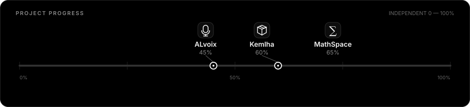

 

<samp>
  <a href="https://ouala.me">portfolio</a>
  ·
  <a href="mailto:alioualaeddine@gmail.com">email</a>
  ·
  <a href="https://github.com/ALI-OUALA">github</a>
</samp>

---

## About

Applied mathematics student at the **National Higher School of Mathematics** in Algeria.

I build **production web products**, **AI experiments**, and **design-led prototypes**—with a particular interest in the point where mathematical thinking, local problems, and good interfaces meet.

**Currently building:** **ALvoix**, an Algerian TTS/STT project.

<table>
  <tr>
    <td width="50%" valign="top">
      <b>Production</b> 
      Websites, landing pages, dashboards, SaaS interfaces, MVPs, academic portfolios, and client demos that need to feel finished.
    </td>
    <td width="50%" valign="top">
      <b>Experiments</b> 
      AI agents, reinforcement learning, speech-data pipelines, simulations, local models, and automation.
    </td>
  </tr>
</table>

---

## In progress

  

---

## Open to

**Frontend / Product Engineering roles · AI/ML internships · selective freelance web projects**  
Remote or Algeria-based.

---

## Work

- [François Berteloot](https://francoisberteloot.com) — Academic website.
- [Peter Stevenhagen](https://peter-stevenhagen.vercel.app) — Academic portfolio.
- [VROAM Hackathon](https://vroam.vercel.app) — Hackathon event experience.
- [Agario RL Experiment](https://github.com/ALI-OUALA/agario-rl-experiment) — PPO browser simulation.
- [Inspra Extension](https://github.com/ALI-OUALA/inspra-extension) — AI design-inspiration extension.
- [Darija TTS Data Cleaning](https://github.com/ALI-OUALA/darija-tts-data-cleaning) — Darija speech-data pipeline.
- [Conway's Game of Life](https://github.com/ALI-OUALA/conways-game-of-life) — Rust desktop simulation.

---

## Main stack

  <samp>TypeScript · React · Next.js · Python · FastAPI · PostgreSQL · React Native · Figma</samp>

